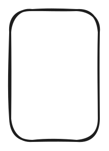

- [说在前面](#说在前面)
- [场景分析](#场景分析)
    - [链式传递](#链式传递)
    - [取消](#取消)
    - [超时](#超时)
    - [数据存储](#数据存储)
- [源码解读](#源码解读)
    - [一个核心数据结构](#一个核心数据结构)
      - [Context](#context)
    - [四种具体实现](#四种具体实现)
      - [emptyCtx](#emptyctx)
      - [cancelCtx](#cancelctx)
      - [timerCtx](#timerctx)
      - [valueCtx](#valuectx)
    - [四个核心方法](#四个核心方法)
      - [Background() \&\& TODO()](#background--todo)
      - [WithCancel()](#withcancel)
      - [WithDeadline()](#withdeadline)
      - [WithTimeout()](#withtimeout)
      - [WithValue()](#withvalue)
- [一些思考](#一些思考)
    - [思考1：emptyCtx 为什么不是 struct{}类型？](#思考1emptyctx-为什么不是-struct类型)
    - [思考2：backgound 和 todo 有什么区别？](#思考2backgound-和-todo-有什么区别)
    - [思考3：cancelCtx 怎么保证父亲 👨 取消的同时取消儿子 👦？](#思考3cancelctx-怎么保证父亲--取消的同时取消儿子-)
    - [思考4：valueCtx 可以用于数据存储吗？](#思考4valuectx-可以用于数据存储吗)

# 说在前面

context 是 golang 中的经典工具，主要在异步场景中用于实现并发协调控制以及对 goroutine 的生命周期管理。除此之外，context 还兼有一定的数据存储能力。本文旨在剖析 context 的核心工作原理。

本文使用到的 Go 版本为 1.18，源码位置 src/context/context.go

# 场景分析

### 链式传递
<div align="center">
  
</div>

### 取消

### 超时

### 数据存储

# 源码解读

### 一个核心数据结构

#### Context

首先 Context 本质是官方提供的一个 interface，实现了该 interface 定义的都被称之为 context

```golang
type Context interface {
	Deadline() (deadline time.Time, ok bool)
	Done() <-chan struct{}
	Err() error
	Value(key any) any
}
```

- Deadline() 返回 ctx 生命终了时间，如果没有则 ok 为 false
- Done() 返回一个 channel 用于判断 ctx 是否已经结束
- Err() 用于 ctx 结束后获取错误信息
- Value() 获取 ctx 种存入的键值对

### 四种具体实现

#### emptyCtx

#### cancelCtx

#### timerCtx

#### valueCtx

### 四个核心方法

#### Background() && TODO()

#### WithCancel()

#### WithDeadline()

#### WithTimeout()

#### WithValue()

# 一些思考

### 思考1：emptyCtx 为什么不是 struct{}类型？

struct{}作为一个空类型并不占用底层存储空间，所以它的多个不同对象有可能会使用相同的地址，无法区分出 background 和 todo 对象。

### 思考2：backgound 和 todo 有什么区别？

本质没有区别，都是 emptyCtx，更多的是语义上的区别，background 通常作为所有 ctx 链的最顶层

### 思考3：cancelCtx 怎么保证父亲 👨 取消的同时取消儿子 👦？

机制 1：cancelCtx 有一个 children 字段记录了所有的子节点，当父节点被取消的时候会给所有子节点来一刀 🔪，依次传递最终将所有子、孙子、孙孙子都刀 🔪 了。父亲取消的时候也会通知爷爷，让爷爷从 children 中删除父亲。

机制 2：如果父亲不是一个 cancelCtx 类型，则不会有 children 属性怎么办？当使用 WithCancel()创建的时候，发现父亲不是 cancelCtx 就会启动一个守护协程判断父亲是否 Done()，如果父亲 over 了，就会干掉儿子并退出；否则儿子先挂了，也会退出。

### 思考4：valueCtx 可以用于数据存储吗？

valueCtx 不适合视为存储介质，存放大量的 kv 数据，它的定位类似于请求头，只适合存放少量作用域较大的全局 meta 数据：
一个 valueCtx 实例只能存一个 kv 对，因此 n 个 kv 对会嵌套 n 个 valueCtx，造成空间浪费；
基于 k 寻找 v 的过程是线性的，时间复杂度 O(N)；
不支持基于 k 的去重，相同 k 可能重复存在，并基于起点的不同，返回不同的 v。
